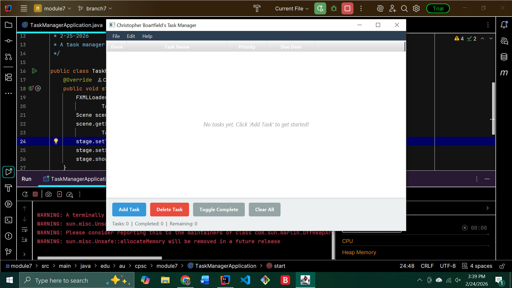
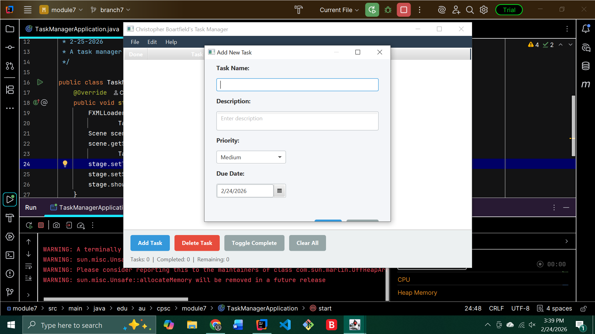
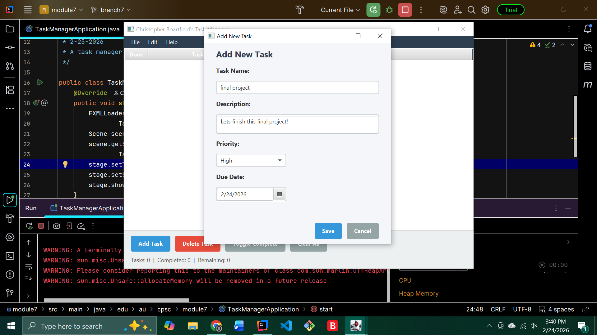
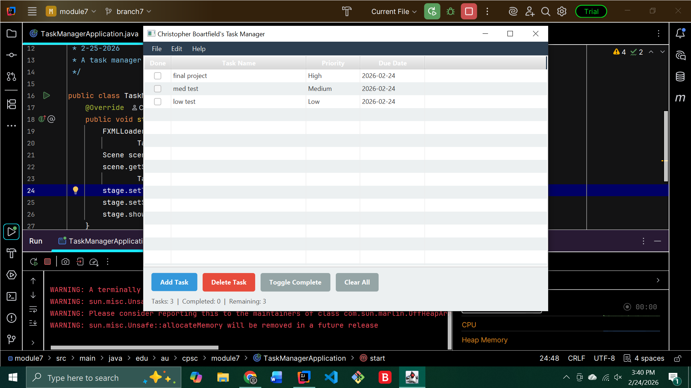
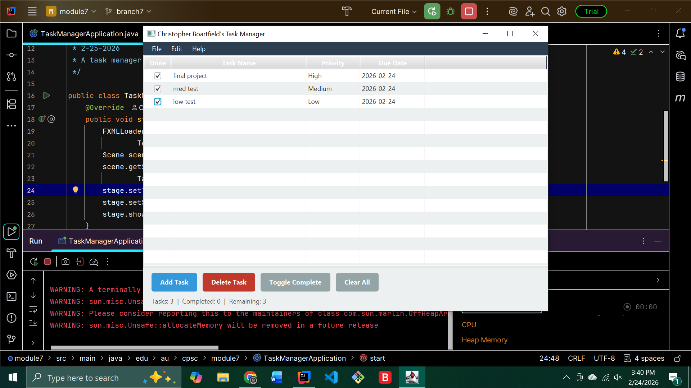

# Task Manager Application

## Inspiration
I have ADHD, and keeping track of tasks and deadlines has always been a struggle for me. I often
forget what I need to do, lose track of due dates, or feel overwhelmed by everything piling up.
I've noticed the same thing with friends and family — everyone could use a simple, no-nonsense
tool to stay organized. That's why I decided to build this Task Manager — something
straightforward that helps me (and people I know) remember what needs to get done without
overcomplicating things.

## Vision
The vision for this application is a lightweight, easy-to-use desktop task manager that helps users
stay on top of their to-do list. It should be simple enough that anyone can open it and start adding
tasks immediately, without a learning curve.

## Basic Functionality
- **Add tasks** with a name, description, priority level (Low/Medium/High), and due date
- **View tasks** in a table with columns for completion status, name, priority, and due date
- **Mark tasks as complete** by toggling the checkbox or using the Toggle Complete button
- **Delete tasks** individually
- **Clear all tasks** with a confirmation dialog
- **Menu bar** with keyboard shortcuts for quick access to all features
- **About dialog** with application information

## How to Use
1. **Run the application** — the main window opens with an empty task table.
2. **Add a task** — click the "Add Task" button or press `Ctrl+N`. A new window opens where you
   can enter the task name, description, priority, and due date. Click "Save" to add it.
3. **Mark a task complete** — select a task in the table and click "Toggle Complete" or press
   `Ctrl+M`. You can also click the checkbox directly in the "Done" column.
4. **Delete a task** — select a task and click "Delete Task" or press `Ctrl+D`.
5. **Clear all tasks** — click "Clear All" from the button bar or Edit menu. A confirmation
   dialog will appear.
6. **View app info** — go to Help > About in the menu bar.
7. **Exit** — use File > Exit or press `Ctrl+Q`.

## Implemented Features
- ✅ Add new tasks with name, description, priority, and due date
- ✅ Display tasks in a sortable table view
- ✅ Mark tasks as complete/incomplete
- ✅ Delete individual tasks
- ✅ Clear all tasks with confirmation
- ✅ Menu bar with keyboard shortcuts (Ctrl+N, Ctrl+D, Ctrl+Q, Ctrl+M)
- ✅ Second window (Add Task dialog)
- ✅ Custom CSS styling with blue/dark color theme
- ✅ Status bar showing task counts
- ✅ About dialog

## Under Construction
- 🔨 Save/load tasks to a file (persistence)
- 🔨 Edit existing tasks
- 🔨 Filter/search tasks
- 🔨 Sort by priority or due date
- 🔨 Notifications for upcoming due dates

## Controls Used (10+ total, 9 unique types)
| Control Type | Where Used |
|---|---|
| MenuBar | Top of main window |
| MenuItem | File, Edit, Help menus |
| TableView | Center of main window |
| TableColumn | Done, Task Name, Priority, Due Date |
| Button | Add, Delete, Toggle, Clear, Save, Cancel |
| Label | Status bar, field labels, error messages |
| TextField | Task name input |
| TextArea | Task description input |
| ComboBox | Priority selector |
| DatePicker | Due date selector |
| CheckBox | Done column (via CheckBoxTableCell) |

## Screenshots

### 

### Adding a Task

### Adding 2nd Task

### Adding 3rd Task

### Completed Task

### Delete Success

